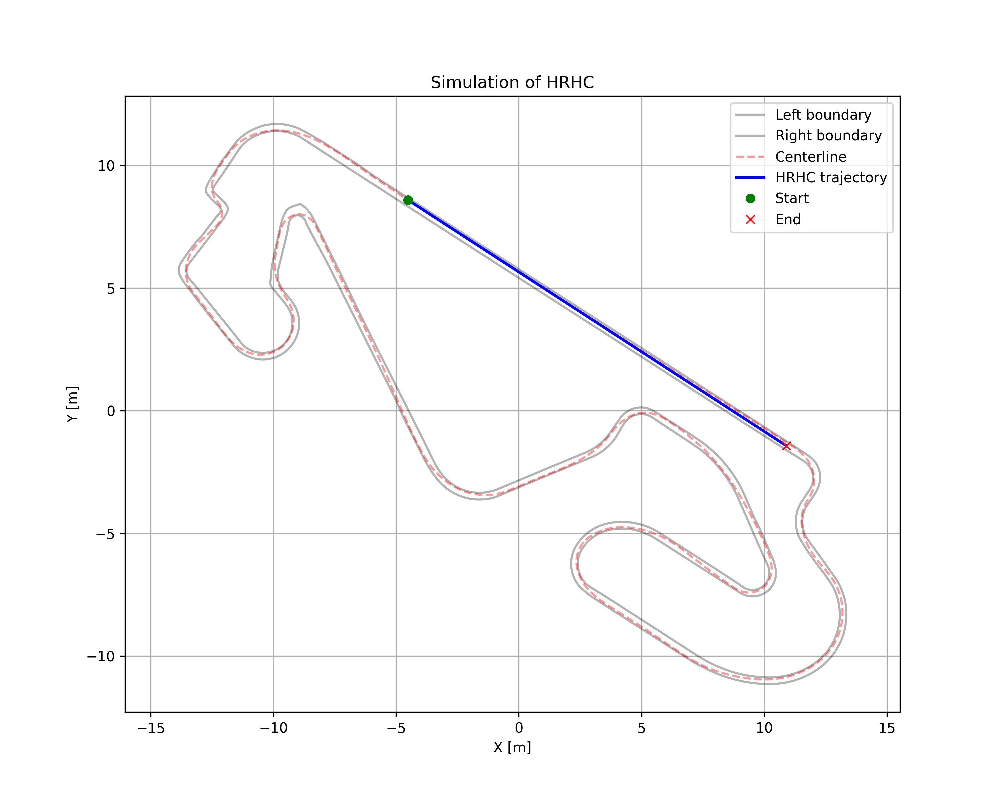
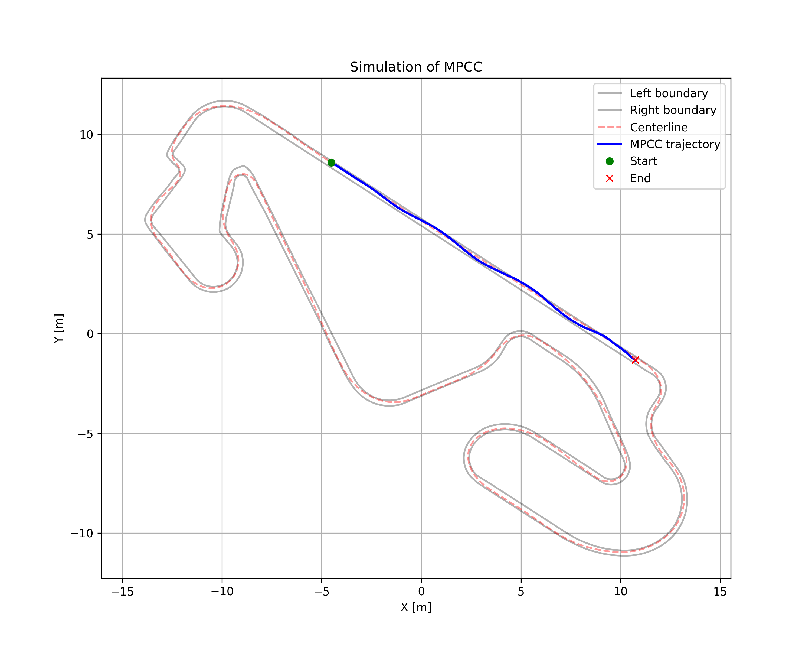

# Optimization-Based Autonomous Racing: HRHC & MPCC Reproduction

基于论文 *Optimization-Based Autonomous Racing of 1:43 Scale RC Cars* 的工程化复现项目，聚焦两类经典自主赛车控制器：

- `HRHC`：分层滚动时域控制器（高层 trim 规划 + 低层跟踪优化）
- `MPCC`：模型预测轮廓控制（路径规划与路径跟踪一体化）

这个仓库的目标不是做“逐行照搬”的论文源码复刻，而是做一个**结构上对齐论文、可运行、可验证、可继续工程推进**的 Python 原型。

## 项目目标

论文的核心问题是：

- 车辆动力学高度非线性，接近轮胎力极限
- 控制必须在短采样周期内完成
- 控制目标不是简单跟踪，而是**在赛道约束内最大化推进量**

本仓库围绕这个目标完成了以下复现：

- 6 维动态自行车模型
- 基于赛道中心线参数化的几何描述
- HRHC 双层控制结构
- MPCC 的轮廓误差、滞后误差、进度奖励和赛道软约束
- LTV 线性化 + RTI 风格热启动
- 闭环仿真、批量回归测试和代码生成预备接口

## 当前状态

当前版本已经完成一轮工程化收尾，具备以下状态：

- `HRHC` 主仿真可稳定跑完 80 步
- `MPCC` 主仿真可稳定跑完 80 步
- `MPCC` 初始化、warm start 和符号建模层面的关键回归已修复
- `HRHC` 对“严格 safe trim 集为空”的场景加入了 relaxed planner 兜底
- 新增回归测试入口，可统计 `fallback`、`recoveries`、`relaxed_plan_steps`
- 新增 `MPCC` 结构化 QP stage 数据导出接口
- 新增 CasADi 内核代码生成脚本，为后续切换结构化 QP/代码生成路线做准备

## 效果预览

### HRHC



### MPCC



## 仓库结构

```text
.
├── dynamic_model.py        # 动态自行车模型
├── track_utils.py          # 赛道样条、中心线投影、宽度查询
├── hrhc_controller.py      # HRHC 控制器
├── mpcc_controller.py      # MPCC 控制器
├── main_sim.py             # 单次闭环仿真入口
├── regression_test.py      # 批量回归测试入口
├── mpcc_codegen.py         # MPCC CasADi 内核代码生成脚本
├── track.csv               # 赛道数据
├── paper.pdf               # 论文原文
├── paper_CN.md             # 论文中文笔记
├── summarize.md            # 论文总结
├── paper_alignment.md      # 当前实现与论文的对齐说明
└── generated/              # 代码生成产物示例
```

## 方法概览

### 1. 动态模型

项目使用动态自行车模型，状态包含：

- 全局位置 `X, Y`
- 航向角 `phi`
- 纵向速度 `vx`
- 横向速度 `vy`
- 横摆角速度 `omega`

其中轮胎侧向力使用 Pacejka 形式的非线性近似，动力学通过 CasADi 建模，并提供：

- 连续时间模型
- RK4 离散模型
- 离散模型 Jacobian

### 2. HRHC

HRHC 保持论文中的双层思想：

- 高层：在固定速度和转向的 trim 网格上搜索进度最优轨迹
- 低层：使用优化器跟踪选中的名义轨迹

工程增强点：

- 对严格 `safe trim` 空集增加 relaxed planner 兜底
- 跟踪层增加 shifted warm start
- 统计 `relaxed_plan_steps`，便于诊断高层规划过紧的问题

### 3. MPCC

MPCC 保持论文中的核心结构：

- 用赛道中心线参数 `theta` 表示路径进度
- 使用轮廓误差 `contour error`
- 使用滞后误差 `lag error`
- 在目标函数中加入推进奖励 `-gamma * v`
- 使用软约束处理赛道边界
- 使用上一轮解移位作为线性化点

工程增强点：

- 显式命名代价权重和约束边界，便于和论文公式对照
- 导出逐 stage 的线性化数据，便于接入结构化 QP 求解器
- 支持 CasADi 内核代码生成

## 与论文的关系

这个仓库的定位是：

- **算法结构尽量对齐论文**
- **工程实现允许做等价近似**

已经对齐的部分：

- HRHC / MPCC 两种控制结构
- MPCC 的 `theta + v` 扩展状态思路
- 轮廓误差与滞后误差
- LTV 线性化与 RTI 风格求解流程
- 赛道约束的带状软约束建模思想

尚未完全等价的部分：

- 论文使用 FORCES 生成的结构化 QP 求解器
- 本项目当前使用 Python + CasADi + `qpoases` / `ipopt`
- 论文强调嵌入式平台 50 Hz 实时运行，本仓库当前仍是 Python 原型
- 避障走廊与多车动态规划部分尚未完整复刻

更详细说明见 [paper_alignment.md](paper_alignment.md)。

## 环境依赖

建议使用 Python `3.10+`。

主要依赖：

- `numpy`
- `scipy`
- `pandas`
- `matplotlib`
- `casadi`

可以用如下方式安装：

```bash
pip install numpy scipy pandas matplotlib casadi
```

如果你希望保持和当前开发环境更接近，推荐使用独立虚拟环境。

## 快速开始

### 1. 运行 HRHC 闭环仿真

```bash
MPLCONFIGDIR=/tmp/mpl python3 main_sim.py --mode hrhc
```

### 2. 运行 MPCC 闭环仿真

```bash
MPLCONFIGDIR=/tmp/mpl python3 main_sim.py --mode mpcc
```

运行结束后会在仓库根目录生成：

- `hrhc_simulation.png`
- `mpcc_simulation.png`

同时终端会输出：

- 当前步数
- 速度
- 赛道进度
- `fallback / recovery / relaxed_plan` 统计

## 回归测试

可以用统一入口批量测试 `HRHC`、`MPCC` 或两者同时测试。

### 只测 MPCC

```bash
python3 regression_test.py --mode mpcc
```

### 只测 HRHC

```bash
python3 regression_test.py --mode hrhc
```

### 同时测试两者

```bash
python3 regression_test.py --mode both
```

常用参数：

```bash
python3 regression_test.py \
  --mode both \
  --cases 10 \
  --steps 80 \
  --theta-span 0.3 \
  --csv regression_results.csv
```

输出指标包括：

- `fallbacks`
- `recoveries`
- `relaxed_plan_steps`
- `mean_ms`
- `max_ms`
- `final_theta`

## MPCC 结构化接口与代码生成

### 1. 导出逐 stage QP 数据

`mpcc_controller.py` 中的 `build_stage_qp_data(...)` 会导出：

- 每个阶段的 `A, B, f`
- 线性化点 `x_bar, u_bar`
- 轮廓误差与滞后误差的一阶展开
- 赛道边界和终端速度边界
- 代价权重与约束元数据

这一步的意义是：

- 把当前 CasADi 原型和未来结构化 QP 求解器解耦
- 为后续接 FORCES、HPIPM、acados 或自定义 sparse QP 求解器铺接口

### 2. 导出 CasADi 内核代码

```bash
python3 mpcc_codegen.py --output-dir generated/mpcc_codegen_ok
```

当前脚本会导出：

- `generated/mpcc_codegen_ok/mpcc_kernels.c`
- `generated/mpcc_codegen_ok/mpcc_metadata.json`

其中包含：

- 连续动力学
- 离散模型
- 离散 Jacobian
- 赛道参数化函数
- MPCC 误差函数

## 已验证的功能

本仓库当前已经验证过以下路径：

- `python3 -m py_compile dynamic_model.py track_utils.py mpcc_controller.py hrhc_controller.py main_sim.py regression_test.py mpcc_codegen.py`
- `MPLCONFIGDIR=/tmp/mpl python3 -u main_sim.py --mode hrhc`
- `MPLCONFIGDIR=/tmp/mpl python3 -u main_sim.py --mode mpcc`
- `python3 -u regression_test.py --mode both --cases 2 --steps 10`
- `python3 -u mpcc_codegen.py --output-dir generated/mpcc_codegen_ok`

其中最近一次回归结果表现为：

- `MPCC: 2/2` 无缝求解
- `HRHC: 2/2` 无缝求解
- `HRHC` 某些场景可能出现 `relaxed_plan_steps > 0`，表示高层严格安全 trim 集为空，但 relaxed planner 已成功接管，未掉入真正 fallback

## 当前限制

这个仓库还不是论文意义上的“最终版工程实现”，主要限制有：

1. `MPCC` 的求解器仍是 Python 原型，不代表嵌入式实时性能。
2. `HRHC` 的 trim library 仍是简化版，没有完整复刻论文中的高层走廊/避障模块。
3. 多车避障与动态规划走廊约束尚未接入主流程。
4. 目前更偏“单车闭环复现 + 工程推进底座”，不是最终竞赛系统。

## 后续可以继续做什么

如果你希望继续把它往“论文级”甚至“可部署”推进，建议优先级如下：

1. 把 `build_stage_qp_data(...)` 接到结构化 QP 求解器。
2. 做问题缩放、变量归一化和终止条件调优。
3. 补论文中的高层走廊约束和避障模块。
4. 做更系统的圈速、横向误差、求解时间 benchmark。
5. 将 CasADi 代码生成结果接入 C/C++ 或更轻量的运行时。

## 致谢

本项目基于论文：

*Optimization-Based Autonomous Racing of 1:43 Scale RC Cars*

如果你也在做相关复现，欢迎把这个仓库作为：

- 论文阅读辅助
- 控制结构理解样例
- 后续结构化 QP / 代码生成实验底座

## License

本仓库采用 `MIT License`。
